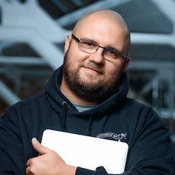
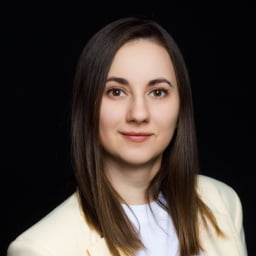
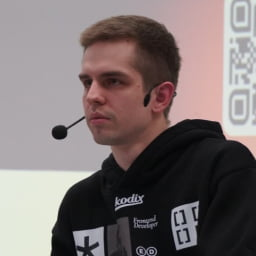

    
19:00–19:10

    
Открытие

    
19:10–19:40

    <h3 class="event__talk-title">System Design для Frontend разработчиков. Что, зачем и как?</h3>
    

        
— Что это за секция? Где её можно встретить? 
    — Почему «на скилле» не вывезти. 
    — Зачем это мне, если я не архитектор. 
    — На что смотрят в процессе. 
    — Частые ошибки во время секции. 
    — По каким материалам готовиться. 
    — Как прокачаться для подобных секций, даже если ты делаешь лендинги.

    

    
    
Василий Ванчук

    
Увлечённый разработчик, который любит нестандартные задачи, кодить и общаться. Обращает внимание на саморазвитие, много читает и помогает развиваться другим. Преподает на курсах и является активным участником сообщества Web Not Bombs.

    
19:40–20:10

    <h3 class="event__talk-title">Frontend-фреймворки: лишь перестав выбирать, мы обретаем свободу</h3>
    

        
Вам приходилось участвовать в холиварах «какой фреймворк лучше»? Или задаваться экзистенциальным вопросом: «Что выбрать для нового проекта»?

        
Мир фронтенда наполнен различными фреймворками (и библиотеками рендеринга). Многие из них основаны на одинаковых принципах, но с разной реализацией и степенью зрелости. При этом у каждого есть свои нюансы — и даже философия.

        
В докладе будет представлен широкий обзор существующих фреймворков и мини-гайд по их выбору. Кто знает, может, скоро и не нужно будет выбирать?

    

    
    
Анна Ширяева

    
Ведущий фронтенд-разработчик Цифрового СИБУРа, организатор <a href="https://moscowjs.org/" target="_blank" rel="noopener">MoscowJS</a>, ведёт телеграм-канал <a href="https://t.me/it_wildlife" target="_blank" rel="noopener">Аня в IT среде обитания</a>.

    
20:10–20:40

    <h3 class="event__talk-title">Как анимации улучшают пользовательский опыт и увеличивают вовлеченность</h3>
    
Анимация — это не просто украшение, а важный инструмент для управления вниманием пользователя и повышения вовлечённости. Я покажу, как с помощью продуманных анимаций можно сделать интерфейсы понятнее, эффективнее для восприятия и приятнее в использовании.

    
    
Евгений Дорошкевич

    
Tech Lead Frontend в KODIX, пишет про фронтенд в своём <a href="https://t.me/DoroshkevichFrontend" target="_blank" rel="noopener">телеграм-канале</a>.

    
20:40–20:50

    
Закрытие

